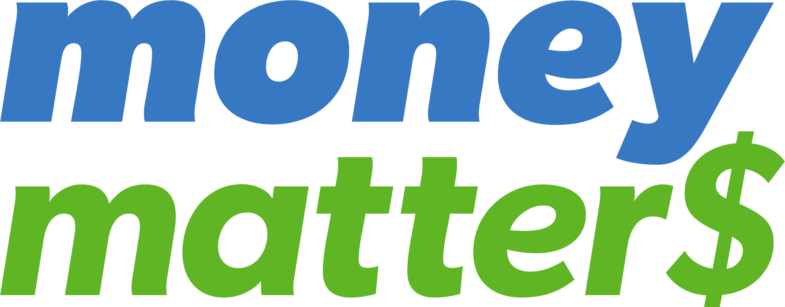

<div align="center">
  
</div>

<a name="readme-top"></a>

# 📗 Table of Contents

- [📖 About the Project](#about-project)
  - [🛠 Built With](#built-with)
    - [Tech Stack](#tech-stack)
    - [Key Features](#key-features)
  - [🎥 Project Presentation](#project-presentation)
  - [🚀 Live Demo](#live-demo)
- [💻 Getting Started](#getting-started)
  - [Prerequisites](#prerequisites)
  - [Setup](#setup)
  - [Install](#install)
  - [Database Setup](#database-setup)
  - [Usage](#usage)
  - [Run Tests](#run-tests)
- [👤 Author](#author)
- [🔭 Future Features](#future-features)
- [🤝 Contributing](#contributing)
- [⭐️ Show Your Support](#support)
- [🙏 Acknowledgements](#acknowledgements)
- [📝 License](#license)

---

# 📖 Money Matters <a name="about-project"></a>

**Money Matters** is a Ruby on Rails budgeting app for managing personal expenses.  
It allows users to add and track transactions, group them by categories, and view insights into their spending.

---

## 🛠 Built With <a name="built-with"></a>

### Tech Stack <a name="tech-stack"></a>
- **Client:** [JavaScript](https://www.javascript.com/)  
- **Server:** [Ruby on Rails](https://rubyonrails.org/)  
- **Database:** [PostgreSQL](https://www.postgresql.org/)  

### Key Features <a name="key-features"></a>
- User authentication (sign up and log in)  
- Create and manage categories of expenses  
- Add and view transactions under specific categories  

<p align="right">(<a href="#readme-top">Back to top</a>)</p>

---

## 🎥 Project Presentation <a name="project-presentation"></a>

- [Watch the demo video](https://www.loom.com/share/44dc3811a4374f98bc00a357d59fb2a8?sid=f7cc6213-3353-4310-8d71-b4954dcbc17a)

<p align="right">(<a href="#readme-top">Back to top</a>)</p>

---

## 🚀 Live Demo <a name="live-demo"></a>

- [Money Matters Live](https://money-matters-p0pp.onrender.com/)

<p align="right">(<a href="#readme-top">Back to top</a>)</p>

---

## 💻 Getting Started <a name="getting-started"></a>

Follow these steps to run the project locally.

### Prerequisites
Ensure you have the following installed:
- [Ruby **v3+**](https://www.ruby-lang.org/en/documentation/installation/)
- [Rails **v7+**](https://guides.rubyonrails.org/install_ruby_on_rails.html)
- [PostgreSQL](https://www.postgresql.org/download/)
- A code editor such as [Visual Studio Code](https://code.visualstudio.com/) or [Cursor](https://cursor.com/downloads)  
- A terminal such as [Git Bash](https://gitforwindows.org/)

### Setup
Clone the repository:
```bash
git clone https://github.com/DJ-MrJay/Money-Matters
```

Navigate into the project folder:
```
cd Money-Matters
```

### Install

Install dependencies:
```
bundle install
```

### Database Setup

- Open config/database.yml and update the username and password fields with your PostgreSQL credentials (around line 21–22).

- Create and migrate the database:
```
rails db:create db:migrate
```

### Usage

Start the server:
```
rails server
```

Open your browser and go to http://localhost:3000/.

### Run tests

Check for linter issues:
```
rubocop
```

Run RSpec tests:
```
rspec spec/<directory>/<file>
```

<p align="right">(<a href="#readme-top">back to top</a>)</p>

## 👤 Author <a name="authors"></a>

👤 **Jonah Wambua**

- [GitHub](https://github.com/DJ-MrJay)
- [X](https://x.com/jonah_wambua)
- [LinkedIn](https://www.linkedin.com/in/jonah-wambua/)

<p align="right">(<a href="#readme-top">back to top</a>)</p>

## 🔭 Future Features <a name="future-features"></a>

- More advanced budgeting features
- Improved front-end design and responsiveness

<p align="right">(<a href="#readme-top">back to top</a>)</p>

## 🤝 Contributing <a name="contributing"></a>

Contributions, issues, and feature requests are welcome.

Feel free to check the [issues page](../../issues/).

<p align="right">(<a href="#readme-top">back to top</a>)</p>

## ⭐️ Show your support <a name="support"></a>

If you find this project helpful, consider giving it a ⭐️.

<p align="right">(<a href="#readme-top">back to top</a>)</p>

## 🙏 Acknowledgments <a name="acknowledgements"></a>

- [Gregoire Vella on Behance](https://www.behance.net/gregoirevella) for the [original design](https://www.behance.net/gallery/19759151/Snapscan-iOs-design-and-branding?tracking_source=) inspiration.
- [Microverse Coding School](https://www.microverse.org) for a A+ curriculum.
- Code reviewers, coding partners, morning and standup teams for their valuable feedback.

<p align="right">(<a href="#readme-top">back to top</a>)</p>

## 📝 License <a name="license"></a>

This project is licensed under the [MIT License](./LICENSE).

<p align="right">(<a href="#readme-top">back to top</a>)</p>
